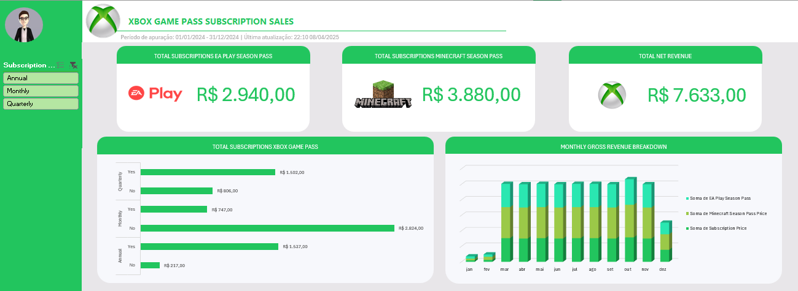

Entendendo os dados
	assinaturas oferecidas pela Microsoft no Xbox cloud
	colunas A:M
	SubId, Nome (pessoa), Plano, StartDate, AutoRenewal, SubPrice, SubType (anual, mensal, etc), EA Play Season Pass (bool) (agregado de assinatura), EAPSP Price, Minecraft Season Pass, MSP Price, Coupon Value, Total Value

Dados x Informações
Dados: valor quantitativo/qualitativo sem contexto, não responde a perguntas.
Informações: pergunta de negócio respondida através de uma análise de dados específica.

Perguntas:
1 - Qual o faturamento total de vendas de planos anuais (contendo todas as assinaturas agregadas)?
2 - Qual o faturamento total de vendas de planos anuais, separados por auto renovação e que não são?

Criação de uma tabela dinâmica dos dados
- Selecionar todas as linhas e colunas da tabela 
- Inserir > Tabela Dinâmica > Da Tabela/Intervalo
- Selecionar Planilha Existente
- Ir até a aba 'Dados'
- Clicar numa célula qualquer.
- OK

> Tabela/Intervalo refere-se a origem dos dados
