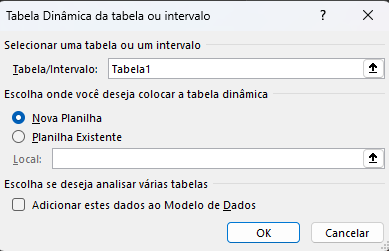

# Entendendo os dados

Assinaturas oferecidas pela Microsoft no Xbox cloud

Colunas A:M

SubId, Nome (pessoa), Plano, StartDate, AutoRenewal, SubPrice, SubType (anual, mensal, etc), EA Play Season Pass (bool) (agregado de assinatura), EAPSP Price, Minecraft Season Pass, MSP Price, Coupon Value, Total Value

# Dados x Informações
Dados: valor quantitativo/qualitativo sem contexto, não responde a perguntas.

Informações: pergunta de negócio respondida através de uma análise de dados específica.

# Perguntas:
1 - Qual o faturamento total de vendas de planos anuais (contendo todas as assinaturas agregadas)?

2 - Qual o faturamento total de vendas de planos anuais, separados por auto renovação e que não são?

3 - Qual o total de assinaturas do EA Play?

# Criação de uma tabela dinâmica dos dados
- Selecionar todas as linhas e colunas da tabela 
- Inserir > Tabela Dinâmica > Da Tabela/Intervalo
- Selecionar Planilha Existente
- Ir até a aba 'Dados'
- Clicar numa célula qualquer.
- OK

> 
> 
> Tabela/Intervalo refere-se a origem dos dados

- Clicar na célula em que a tabela foi criada
- Arrastar os atributos 'Subscription Type' e 'Auto Renewal' para a seção 'Linhas' e 'Total Value' para 'Valores', mostrados no lado direito da tela
- Clicar na tabela dinâmica
- Clicar em 'Análise de Tabela Dinâmica', na parte superior da barra do Excel
- Gráfico Dinâmico > Barras > Barras Agrupadas > OK
- Formatar e estilizar o gráfico da maneira desejada
- Clicar na tabela dinâmica
- Inserir > Filtros > Segmentação de Dados > Subscription Type
- Ir para aba 'Dashboards' e personalizar
- Recortar o filtro e o gráfico gerados na aba 'Cálculos' e transferí-los para a aba 'Dashboards'
- Voltar para aba 'Cálculos'
- Copiar e colar a tabela
- Substituir os atributos em 'Linhas' por 'Plans', os em 'Filtros' por 'Subscription Type' e em 'Valores' por 'EA Play Season PassPrice'
- No aributo 'EA Play Season PassPrice' em 'Valoes', clicar na seta ao lado do atributo
- Configurações do Campo de Valor > Soma > OK
- Clicar numa célula qualquer e digitar '='
- Clicar no valor ao lado de 'Total Geral' da nova tabela dinâmica criada > OK
- Formatar como moeda (Página inicial > Número, mudar para 'moeda')
- Exportar para a aba 'Dashboard' numa forma geométrica de sua escolha e trazer contexto para a informação
- Replicar o passo a passo para criar uma nova tabela dinâmica mas com a informação de 'Minecraft Season Pass Price' no lugar de 'EA Play Season Pass Price'

# Resultado:

